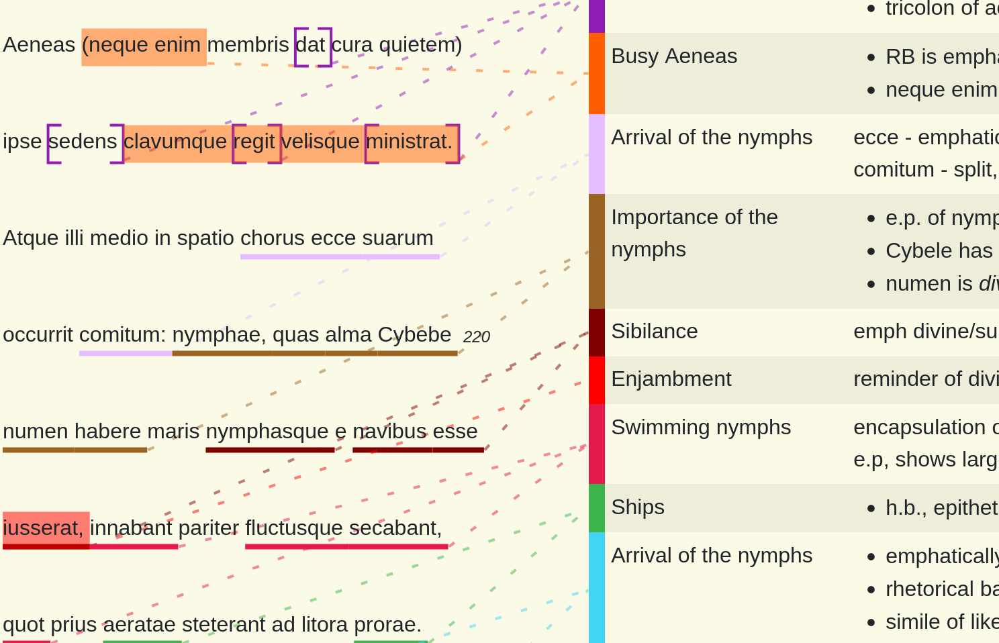

---

During my A-Level studies (end of school exams in the UK), I created (as an act of procrastination) a website to annotate my Latin set texts, to neatly and tidily note down everything we discussed and translated in class.

An example use of the website can be found here, for [Aeneid Book 10](https://docann.maxcl.co.uk/Annotate/View?docAnnId=3&book=10&section=215-259). It works best/only on a wide computer screen, so that the original text and annotations can be displayed side-by-side. You can also turn on/off coloured mode, suitable for printing on landscape A4 paper. Some prose annotation is also on there, specifically [Tacitus Annals Book 1](https://docann.maxcl.co.uk/Annotate/View?docAnnId=2&book=1&section=48).

The website is written in C# and TypeScript (all code [here](https://github.com/mtcairneyleeming/DocumentAnnotation)), and would not be remotely possible without the work of the [Perseus Digital Library](http://www.perseus.tufts.edu/hopper/).

